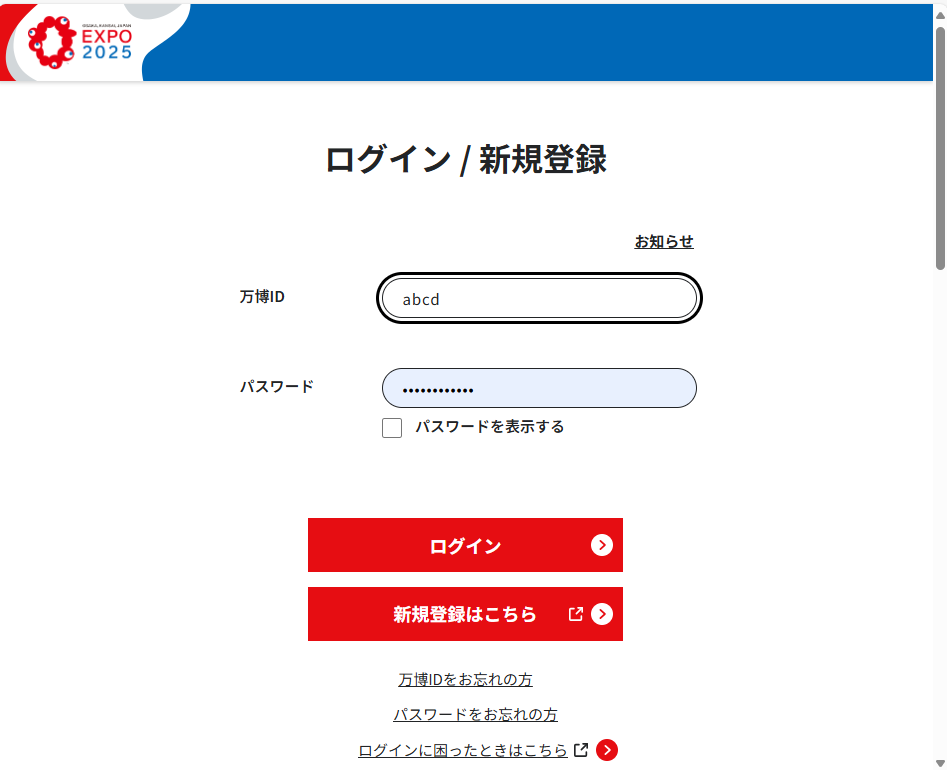
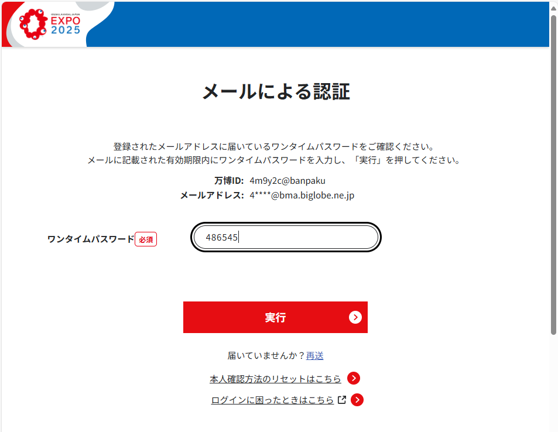
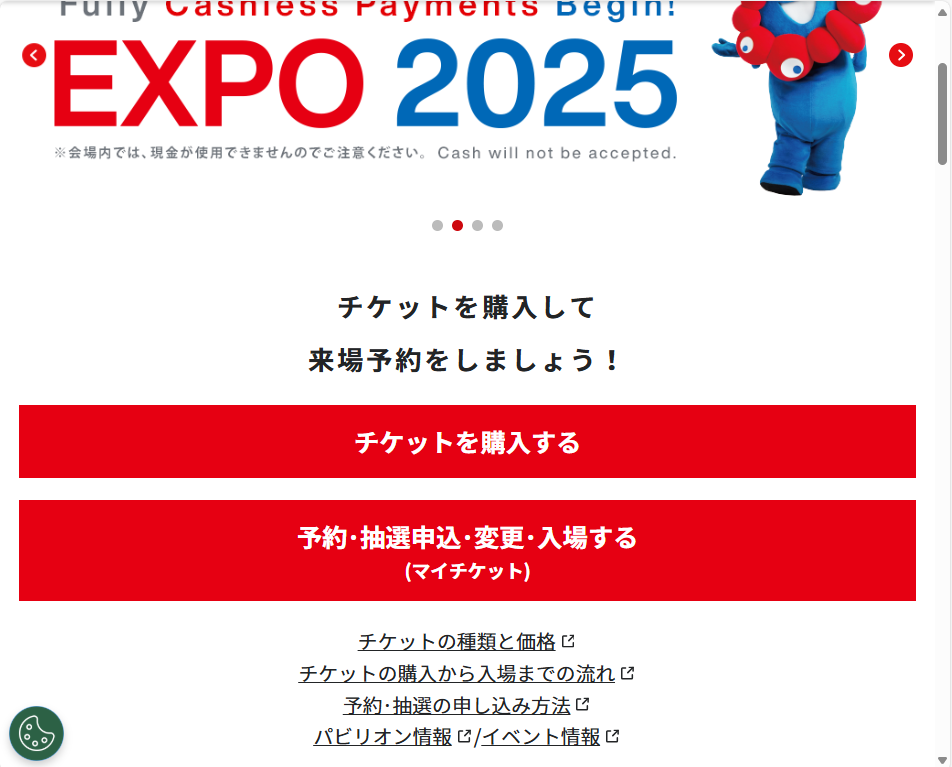
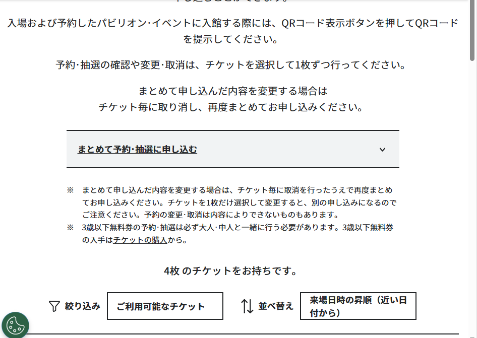
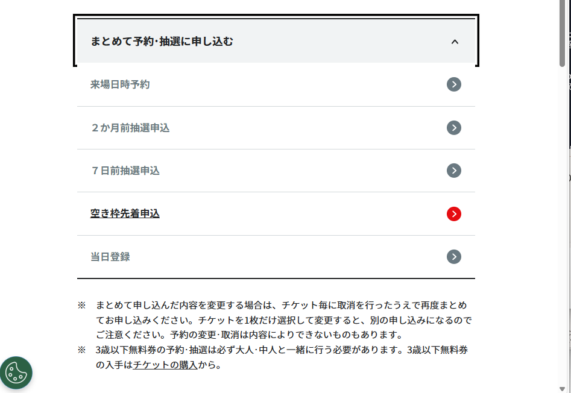
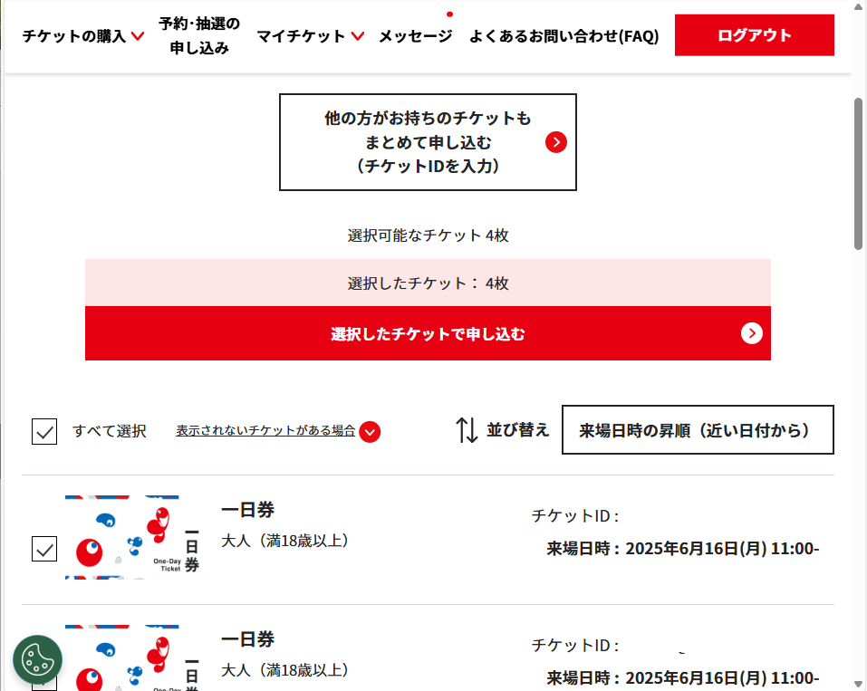
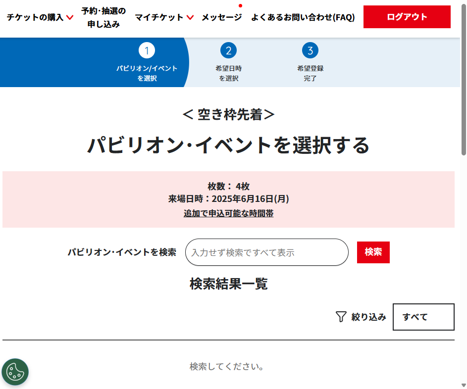

# Expo 2025 Pavilion Event Search / Expo2025 パビリオンイベント検索


3日前空き枠先着申し込みのページの検索用UIが、思いつくパビリオン名を繰り返し入力するというものでした(※)。これは疲れます。APIも用意されていないようなので、あらかじめパビリオンのリストを作成しておいて、自動的に繰り返し検索できるコードを`Copilot`を使って作成しました。

※後でわかりましたが、**検索ボックスを空のまま検索ボタンを押すと全てのパビリオンとイベントの検索結果を表示することができました。**（検索ボックスにうっすらと「入力せず検索ですべて表示」と書いてありました。

This repository contains a Python script that automates the search for pavilion event tickets on the Expo 2025 ticket website using Playwright and Pandas.  
本リポジトリは、Playwright と Pandas を用いて Expo 2025 チケットサイトでパビリオンのイベント情報を自動検索する Python スクリプトを含みます。

## 万博サイトログイン～検索ページまでの操作手順

4枚の手持ちチケットを全てを空き枠先着予約に申し込む場合です。（手持ちチケットをすべて選択し、「選択したチケットで申し込む」場合です）

1. 万博サイトにログインします


2. ワンタイムパスワードを入力します
メール利用の場合


3. 予約・抽選申込・変更・入場する（マイチケット）を押します


4. チケットを選択します
まとめて予約・抽選に申し込むを押します


5. 空き枠先着申込を押します


6. 選択したチケットで申し込むを押します


7. パビリオン・イベントを選択するページで待機します


## Features / 特徴

- **Persistent Login Session / 永続的なログインセッション**  
  The script uses a persistent Chrome user data directory to maintain login states.  
  スクリプトは、Chrome のユーザーデータディレクトリを使用してログイン状態を保持します。

- **Automated Search Process / 自動検索プロセス**  
  Automatically fills in the search form and triggers the search by clicking the search button.  
  検索フォームに自動でキーワードを入力し、検索ボタン（`<button class="basic-btn type2 style_search_btn__ZuOpx">`）を自動クリックします。

- **Conditional Pause / 条件付きポーズ**  
  If search results are found, the script pauses for user verification before proceeding.  
  検索結果が見つかった場合は、ユーザーが確認できるように自動で一時停止します。該当なしの場合はそのまま自動継続します。

- **Result Logging / 結果の記録**  
  Logs the search results in a CSV file (`availability_results.csv`).  
  検索結果は CSV ファイル（`availability_results.csv`）に記録します。

## パビリオンリストの自動生成

公式PDFからパビリオンリスト（CSV）を自動生成する場合は、`pavilions_list.py` を利用してください。  
事前に `tabula-py` をインストールし、PDFをダウンロードしておきます。

公式サイトから、以下のPDFを取得できました。
- [大阪・関西万博 パビリオン一覧 (the Expo2025 Pavilions)](https://www.expo2025.or.jp/en/wp-content/uploads/sites/2/2025/05/05130900_servicehours.pdf)

```bash
pip install tabula-py
python pavilions_list.py
```

生成された `expo2025_pavilions_full.csv` から必要なカラムのみ抽出し、`pavilions.csv` として利用できます。

## Prerequisites / 前提条件

- **Python 3.7+**  
- [Playwright for Python](https://playwright.dev/python/)  
- [Pandas](https://pandas.pydata.org/)  
- A CSV file named `pavilions.csv` in the repository root, containing one pavilion name per line(or add any missing ones).  
  リポジトリルートに、パビリオン名称を1行ずつ記載した `pavilions.csv` を用意（足らずを追加）してください。
- A Chrome user profile already logged in to the Expo ticket website.  
  Expo チケットサイトにログイン済みの Chrome プロファイルであることが必要です。
- [tabula-py](https://pypi.org/project/tabula-py/)（パビリオンリスト自動生成用、必要に応じて）

## Installation / インストール

1. **Clone the Repository / リポジトリのクローン**

   ```bash
   git clone https://github.com/keides2/expo2025_Pavilion_Event_Search.git
   cd expo2025_Pavilion_Event_Search
   ```

2. **Install Required Packages / 必要なパッケージのインストール**

   ```bash
   pip install playwright pandas
   ```

3. **Install Playwright Browsers / Playwright ブラウザのインストール**

   ```bash
   playwright install
   ```

## Usage / 使い方

1. **Prepare Your CSV File / CSVファイルの準備**
   Make sure `pavilions.csv` is ready with one pavilion name per line.  
   各行にパビリオン名称を記入した `pavilions.csv` を用意してください。

2. **Configure the Script / スクリプトを設定する**  
   Confirm that the `user_data_dir` is correctly set in `search_pavilions.py` as follows (adjust for your username):
   次のように、`search_pavilions.py` で `user_data_dir` が正しく設定されていることを確認します。（修正が必要です）

   ```python
   user_data_dir="C:/Users/HP/AppData/Local/Google/Chrome/User Data"
   ```

3. **Run the Script / スクリプトを実行する**  

   ```bash
   python search_pavilions.py
   ```

4. **Manual Step – Transition from My Ticket Page / 手動ステップ – マイチケットページからの遷移**  
   After launching, the browser may initially display the My Ticket page. Manually navigate from My Ticket to the search page. When finished, press **Enter** at the prompt: マイチケットの選択が終わったら Enter を押してください...
   起動後、ブラウザに最初に「マイチケット」ページが表示される場合があります。「マイチケット」から検索ページへ手動で移動してください。完了したら、プロンプト「マイチケットの選択が終わったら Enter を押してください...」で**Enter**を押してください。

5. **Automated Search Process / 自動検索プロセス**  
   For each pavilion name:
   - The script automatically fills in the search field (`input.  style_search_text__TH7D1`).
   - It clicks the search button defined by:
   各パビリオン名について：
   - スクリプトは検索フィールド（`input.style_search_text__TH7D1`）に自動的   に入力します。
   - 次のように定義された検索ボタンをクリックします。
  
     ```html
     <button class="basic-btn type2 style_search_btn__ZuOpx">
       <span data-message-code="SW_GP_DL_123_0008"    class="style_renderer__ip0Pm">検索</span>
     </button>
     ```

   - If no matching result is found (displaying "検索条件を変えて検索してください。"), it proceeds automatically.
   - If matching results are found, the script pauses and waits for user confirmation by showing:
   - 一致する結果が見つからない場合（「検索条件を変えて検索してください。」と表示される場合）、自動的に処理が続行されます。
   - 一致する結果が見つかった場合、スクリプトは一時停止し、次の内容を表示してユーザーの確認を待ちます。

   ```text
   検索結果が見つかりました。内容を確認して、次に進むには Enter を押してください...
   ```

6. **Results**  
   After processing, the results are saved in `availability_results.csv`.  
   結果は `availability_results.csv` にログ出力されます。

## Script Overview / スクリプト概要

The main script (`search_pavilions.py`) uses Playwright to navigate to the search page, perform automated searches for each pavilion name, and capture the search results.  
主なスクリプト (`search_pavilions.py`) は、Playwright を使用して検索ページへ移動し、各パビリオン名称で自動検索を行い、結果をスクレイピングします。

## Customization / カスタマイズ

- **Selectors / セレクターの変更**  
If the website structure changes, update the selectors in the script (e.g., `input.style_search_text__TH7D1` for the search field and `button.basic-btn.type2.style_search_btn__ZuOpx` for the search button).  
サイトの HTML 構造が変わった場合、スクリプト内のセレクターを修正してください。

- **Timeout Settings / タイムアウト設定**  
Adjust the timeout values in the navigation and waiting functions if necessary.  
ページ遷移や要素待機のタイムアウト値を必要に応じて調整してください。

## Troubleshooting / トラブルシューティング

- **Timeout or Element Not Found Errors / タイムアウトエラー・要素が見つからない場合**  
Verify that you are on the correct search page and that the selectors match the current website.  
正しい検索ページにいるか、セレクターがサイトの構造に合致しているか確認してください。

- **Login Issues / ログインの問題**  
Ensure the `user_data_dir` path is correct and that your Chrome profile is logged in.  
`user_data_dir` のパスが正しく、Chrome プロフィールでログイン済みであることを確認してください。

## License / ライセンス

This project is licensed under the MIT License.  
本プロジェクトは MIT ライセンスのもとで公開されています。

## Acknowledgments / 謝辞

- [Playwright](https://playwright.dev)  
- [Pandas](https://pandas.pydata.org/)  
- Expo 2025 Ticket System / Expo 2025 チケットシステム

## Note / メモ

- Replace `yourusername` in the clone instruction with your actual GitHub username.  
- クローン時の `yourusername` をご自身の GitHub ユーザー名に置き換えてください。

---
2025/06/14 keides2 初版
